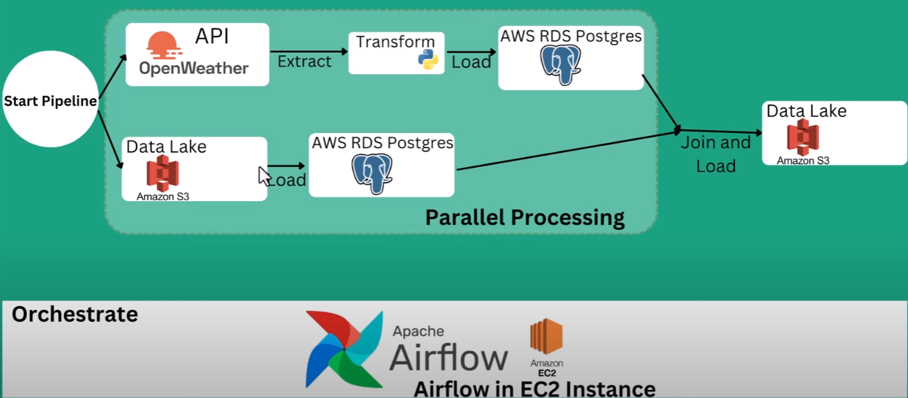
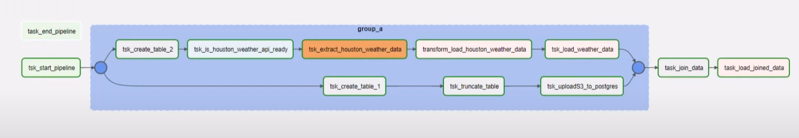

# openweather_api_with_airflow_AWS

## Overview
In this project, we will build and automate an ETL process that can extract current weather data from open weather map API, transform the data and load the data into an S3 bucket using Apache Airflow.
we use airflow to orchestrate a parallel processing ETL pipeline on AWS EC2.
## Project Goals
1. Data Ingestion — Build a mechanism to ingest data from from different sources.
2. ETL Pileline — We are getting data in raw format, transforming this data into the proper format and join with another data source to get more info using  Apache Airflow.
3. Cloud — In this case, we will use AWS

## Services we will be using
1. Amazon S3: Amazon S3 is an object storage service that provides manufacturing scalability, data availability, security, and performance.
2. AWS IAM: This is nothing but identity and access management which enables us to manage access to AWS services and resources securely.
3. AWS RDS Postgres: use to support relational databases Postgres
4. AWS EC2: We use it to install Apache Airflow Software.
## Data Used
Open Weather API

## Architecture Diagram

## Dag Process (Airflow)

